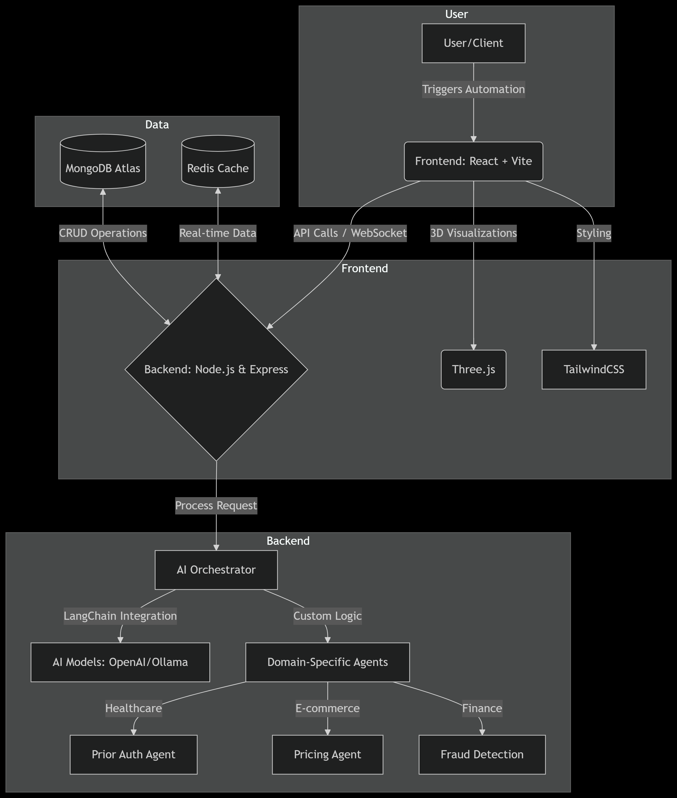
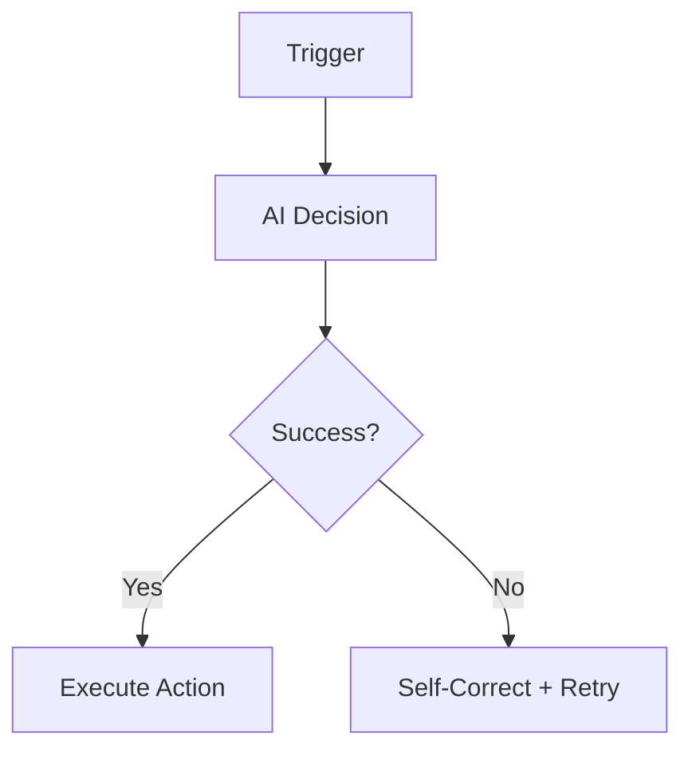

# 🚀 AetherMind - Intelligent Automation, Redefined

**Empower Your Business with Autonomous AI Agents**  
*AetherMind transforms complex workflows into seamless, self-optimizing processes—so you can focus on what truly matters.*

---

<div align="center">
  
  
  
</div>

---

## 🌟 Why AetherMind?

In a world where **85% of repetitive tasks** still burden teams, AetherMind delivers **AI agents that think, adapt, and act**. We’re not just automating workflows—we’re building digital teammates that learn your business and grow with it.



---

## 🛠️ Features That Set Us Apart

### 🤖 **Autonomous Problem-Solving**
- Self-healing agents that troubleshoot errors in real-time  
- Multi-agent collaboration for complex tasks  
- Context-aware decision-making powered by **LangChain & custom LLMs**

### 🎯 **Industry-Specific Solutions**
- **Healthcare**: HIPAA-compliant patient data automation  
- **E-commerce**: Dynamic inventory/pricing agents  
- **Finance**: Fraud detection & compliance automation  

### 🔄 **End-to-End Workflow Builder**


### 📊 **Insights That Drive Action**
- Real-time analytics dashboard  
- Predictive trend forecasting  
- Automated KPI optimization  

---

## 🧩 Tech Stack: Built for Scale

| Layer           | Technologies                                                                                     |
|------------------|--------------------------------------------------------------------------------------------------|
| **Frontend**     | React.js (Vite), TailwindCSS, Three.js, Framer Motion                                            |
| **Backend**      | Node.js, Express.js, WebSocket (Real-time sync)                                                  |
| **Database**     | MongoDB (Atlas), Redis (Caching)                                                                 |
| **AI Core**      | LangChain, OpenAI API, Ollama, Custom Fine-Tuned LLMs (Q2 2024 Roadmap)                         |
| **DevOps**       | Docker, Kubernetes (GCP), GitHub Actions                                                         |

---

## 🚦 Quick Start

### Prerequisites
- Node.js v18+
- MongoDB Atlas URI
- OpenAI API Key

### Installation
```bash
git clone https://github.com/SatyamSingh8306/AetherMind.git
cd AetherMind/client
npm install
npm run dev
```

### Your First AI Agent
```javascript
// Sample healthcare prior-auth automation
const priorAuthAgent = new AetherMind.Agent({
  workflow: [
    {action: "fetch_patient_data", model: "gpt-4-medical"},
    {action: "insurance_check", rules: "HIPAA-Compliant"},
    {action: "auto_submit_approval"}
  ]
});
```

---

## 🗺️ Roadmap 2024

| Quarter | Key Milestones                                                                 |
|---------|--------------------------------------------------------------------------------|
| Q2      | Enterprise SSO, Custom LLM Training UI, AWS/GCP Integration                    |
| Q3      | Agent Marketplace Launch, Mobile SDK                                           |
| Q4      | Self-Organizing Agent Swarms (Beta), SOC2 Compliance                           |

---

## 🤝 Contribute to the Future

We’re open-source friendly! Check out our:
- [Good First Issues](https://github.com/SatyamSingh8306/AetherMind/issues?q=is%3Aopen+is%3Aissue+label%3A%22good+first+issue%22)
- [Contributor Guidelines](https://github.com/SatyamSingh8306/AetherMind/blob/main/CONTRIBUTING.md)
- [Code of Conduct](https://github.com/SatyamSingh8306/AetherMind/blob/main/CODE_OF_CONDUCT.md)

---

## 📬 Let’s Revolutionize Automation Together

**Founder & Lead Architect**  
Satyam Singh  
📧 [satyamsingh7734@gmail.com](mailto:satyamsingh7734@gmail.com)  
🔗 [LinkedIn](https://linkedin.com/in/satyam8306) | [GitHub](https://github.com/SatyamSingh8306)  

**Business Partnerships**  
🌐 [partners@aethermind.ai](mailto:partners@aethermind.ai)  

---

> *“The first rule of any technology is that automation applied to an efficient operation will magnify the efficiency. The second is that automation applied to an inefficient operation will magnify the inefficiency.”*  
> — **Bill Gates** *(A principle we live by at AetherMind)*

---

<div align="center">
  <h3>⚡ Ready to Automate Tomorrow?</h3>
  <a href="https://aethermind.ai/demo">Schedule a Demo</a> | 
  <a href="https://github.com/SatyamSingh8306/AetherMind/wiki">Documentation</a> | 
  <a href="https://discord.gg/aethermind">Join Our Community</a>
</div>
