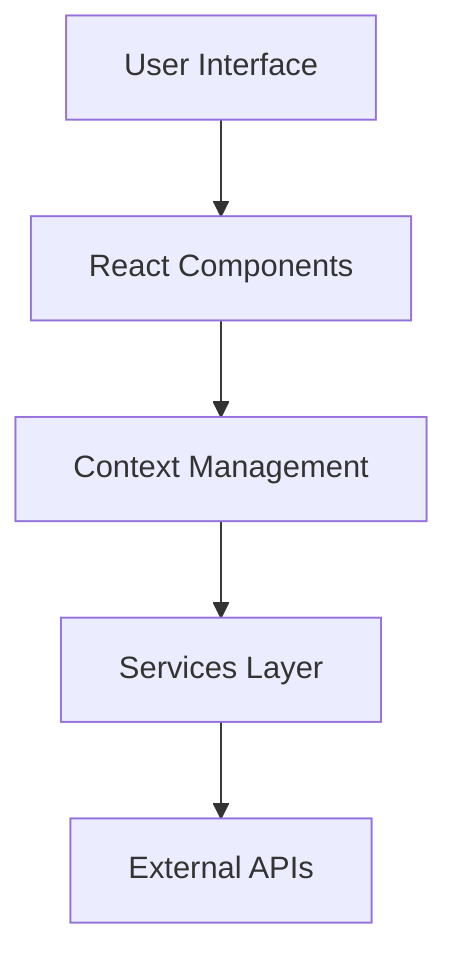

# 🚀 AetherMind - Intelligent Automation, Redefined

**Empower Your Business with Autonomous AI Agents**  
*AetherMind transforms complex workflows into seamless, self-optimizing processes—so you can focus on what truly matters.*

---

<div align="center">
  
  
  
</div>

---

## 🌟 Why AetherMind?

In a world where **85% of repetitive tasks** still burden teams, AetherMind delivers **AI agents that think, adapt, and act**. We're not just automating workflows—we're building digital teammates that learn your business and grow with it.


---

## 🛠️ Features That Set Us Apart

### 🤖 **Intelligent Chat Interface**
- Real-time AI-powered conversations
- Context-aware responses
- Seamless integration with business workflows

### 🎯 **Modern User Experience**
- Responsive and intuitive design
- Interactive 3D visualizations using Three.js
- Smooth animations with Framer Motion

### 🔄 **Component-Based Architecture**


### 📊 **Extensible Design**
- Modular component structure
- Scalable service architecture
- Easy integration with new features

---

## 🧩 Tech Stack: Built for Scale

| Layer           | Technologies                                                                                     |
|------------------|--------------------------------------------------------------------------------------------------|
| **Frontend**     | React 19, Vite, TailwindCSS, Three.js, React Router v7                                           |
| **UI Components**| FontAwesome, React Icons, Custom Components                                                      |
| **Styling**      | SASS, TailwindCSS, PostCSS                                                                       |
| **Development**  | ESLint, Vite, Node.js                                                                            |
| **Deployment**   | Vercel, Render                                                                                   |

---

## 🚦 Quick Start

### Prerequisites
- Node.js v18+
- npm or yarn package manager

### Installation
```bash
git clone https://github.com/SatyamSingh8306/AetherMind.git
cd AetherMind
npm install
npm run dev
```

### Development Scripts
```bash
npm run dev      # Start development server
npm run build    # Build for production
npm run lint     # Run ESLint
npm run preview  # Preview production build
```

---

## 📁 Project Structure

```
src/
├── assets/      # Static assets and images
├── components/  # Reusable UI components
├── context/     # React context providers
├── data/        # Static data and configurations
├── pages/       # Page components
├── services/    # API and business logic
└── styles/      # Global styles and themes
```

---

## 🗺️ Roadmap 2024

| Quarter | Key Milestones                                                                 |
|---------|--------------------------------------------------------------------------------|
| Q2      | Enhanced Chat Features, User Authentication, Real-time Updates                 |
| Q3      | AI Agent Integration, Analytics Dashboard, Mobile Responsiveness               |
| Q4      | Enterprise Features, Performance Optimization, Advanced Customization          |

---

## 🤝 Contribute to the Future

We're open-source friendly! Check out our:
- [Good First Issues](https://github.com/SatyamSingh8306/AetherMind/issues?q=is%3Aopen+is%3Aissue+label%3A%22good+first+issue%22)
- [Contributor Guidelines](https://github.com/SatyamSingh8306/AetherMind/blob/main/CONTRIBUTING.md)
- [Code of Conduct](https://github.com/SatyamSingh8306/AetherMind/blob/main/CODE_OF_CONDUCT.md)

---

## 📬 Let's Revolutionize Automation Together

**Founder & Lead Architect**  
Satyam Singh  
📧 [satyamsingh7734@gmail.com](mailto:satyamsingh7734@gmail.com)  
🔗 [LinkedIn](https://www.linkedin.com/company/aether-mind/) | [GitHub](https://github.com/Aether-Mind/AetherMind)  

**Business Partnerships**  
🌐 [partners@aethermind.ai](mailto:partners@aethermind.ai)  

---

> *"The first rule of any technology is that automation applied to an efficient operation will magnify the efficiency. The second is that automation applied to an inefficient operation will magnify the inefficiency."*  
> — **Bill Gates** *(A principle we live by at AetherMind)*

---

<div align="center">
  <h3>⚡ Ready to Automate Tomorrow?</h3>
  <a href="https://aethermind.ai/demo">Schedule a Demo</a> | 
  <a href="https://github.com/SatyamSingh8306/AetherMind/wiki">Documentation</a> | 
  <a href="https://discord.gg/aethermind">Join Our Community</a>
</div>
